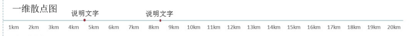
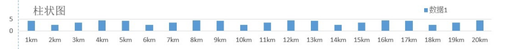
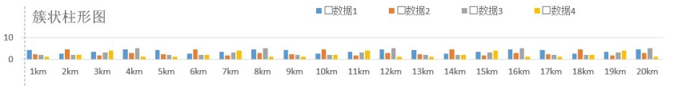
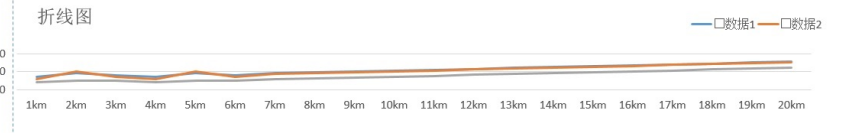
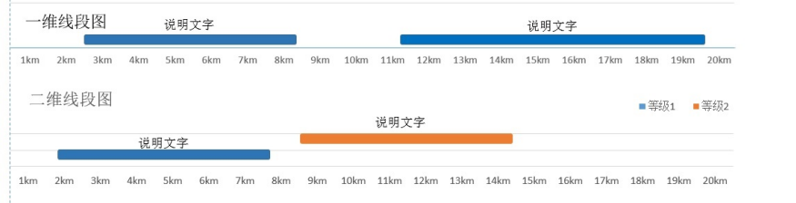
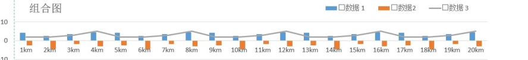

##  
数据格式：
```
{"boxname": //所勾选的项（需要的项）
  {
    "x": x1,x2,x3...，//x值
    "data": data1, data2,data3..., //y
  }
}
```
<!-- ## 
数据格式：
```
{"boxname":
  {
    "x": x1,x2,x3...，//x所在段
    "h":data1, data2,data3..., //y
  }
}
``` -->

## 
数据格式：
```
{"boxname":
  "txxx", //分类
  {
    "type":txxx, //分类
    "x": x1,x2,x3...，//x所在段
    "h": "data": data1, data2,data3.., //y
  },
  "tyyy", //分类
  {
    "type":tyyy, //分类
    "x": x1,x2,x3...，//x所在段
    "h": "data": data1, data2,data3.., //y
  }
}
```

## 
数据格式：
```
{"boxname":
"type":type1, //分类
  {

    "x": x1,x2,x3...，//x
    "h": "data": data1, data2,data3.., //y
  },
    "type":type2, //分类
  {

    "x": x1,x2,x3...，//x
    "h": "data": data1, data2,data3.., //y
  }
}
```

## 

```
{"boxname":
"type":type1, //分类
  {

    "x1": x1,x2,x3...，//x
    "x2": x1,x2,x3...，//x
    "h": "data": data1, data2,data3.., //y
  },
    "type":type1, //分类
  {
    "x1": x1,x2,x3...，//x
    "x2": x1,x2,x3...，//x
    "h": "data": data1, data2,data3.., //y
  },
}
```

## 
```
{"boxname":
  "type":type1, //分类
  {

    "x1": x1,x2,x3...，//x
    "h": "data": data1, data2,data3.., //y
  },
    "type":type2, //分类
  {
    "x1": x1,x2,x3...，//x
    "h": "data": data1, data2,data3.., //y
  },
}
```
