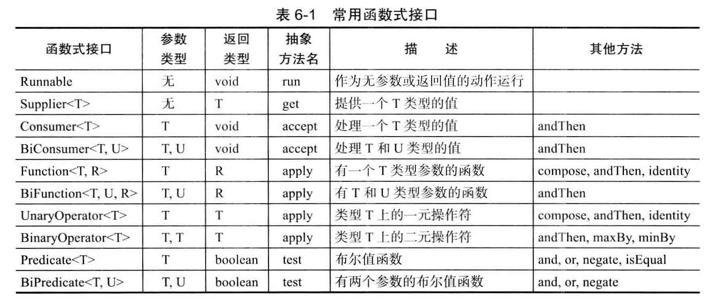
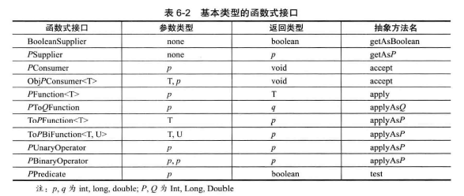

```java
public Test{
  interface Func1{
      void run();
      //SE8中接口可以声明非抽象方法
      default void run1(){

      }
      static void run2(){
          System.out.println("Tuasdad");
      }
  }

  interface Func2<T>{
      T run(String s);
  }

  void sayHello(Func1 f1){
      System.out.print("Hello ");
      f1.run();
      f1.run2();
  }
  String getTime(Func2<String> f2){
      String now = new Date().toString();
      return f2.run(now);
  }

  @Test
  void contextLoads() {
      String s = "now time is: ";
      sayHello(()-> {
          System.out.println("jack");
      });

      System.out.println(getTime((now1)-> {
          return s + now1;
      }));
  }
}
```
运行结果：
```
Hello jack
Tuasdad
now time: Mon Nov 25 14:46:54 CST 2019
```

1. lamda表达式的目标类型必须是**只包含一个抽象方法**的**接口**，这种接口称为**函数式接口**
2. 局部变量用在lamda表达式中必须不能修改它（
Variable used in lambda expression should be final or effectively final）
3. 不能把lamda表达式赋给Object对象，因为Object不是一个函数式接口
4. java.util.function中定义了很多通用的函数式接口

常用函数式接口|参数类型|返回类型|抽象方法名|描述|其他方法
-|-|-|-|-|-
Runnable|无|void|run|作为无参数或返回值的动作运行
Supplier<T>|无|T|get|返回一个T类型的值
...

<center>




</center>
